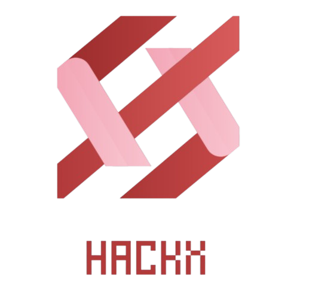
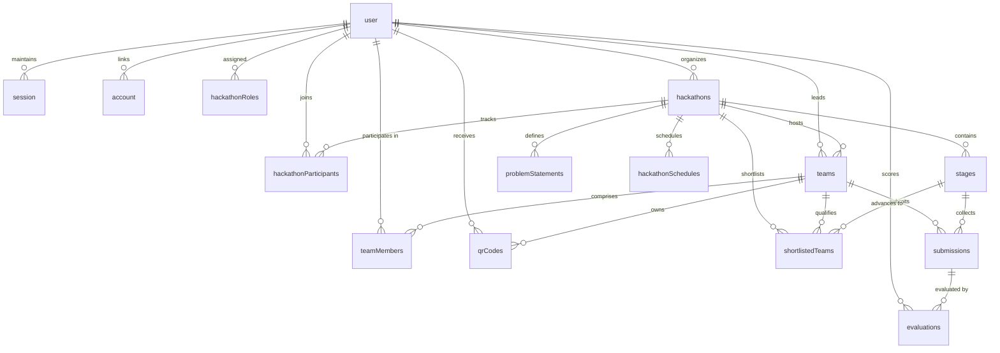

<div align="center">



# HackManage (Hack-Manage)

### The Complete Operating System for In-Person & Virtual Hackathons

**From registration and real-time stage progression to multi-criteria judging, QR meal passes, and automated PDF certification.**

[](https://nextjs.org/)
[](https://react.dev/)
[](https://hono.dev/)
[](https://orm.drizzle.team/)
[](https://turso.tech/)
[](https://tailwindcss.com/)
[](https://better-auth.com/)
[](https://cloudinary.com/)
[](LICENSE)

---

[Key Highlights](#-key-highlights) •
[System Architecture](#-system-architecture) •
[Data & Relational Design](#-data--relational-design) •
[Role-Based Features](#-role-based-features) •
[Getting Started](#-getting-started) •
[Environment Configuration](#-environment-configuration) •
[Production Deployment](#-production-deployment-playbook) •
[API Reference](#-api-reference)

</div>

---

## 🌟 Key Highlights

Most hackathon operations are fractured across Google Forms (registration), Discord (team coordination), Devpost (submissions), spreadsheets (judging scoring), and physical paper coupons (meals & entry). 

**HackManage** unifies the entire event lifecycle into a single, high-performance platform:

- ⚡ **1-Click Participation & Auto-Team Provisioning**: Joining a hackathon automatically initializes a team workspace, assigns the creator as team leader, and handles atomic membership invites.
- 🎯 **Multi-Stage Evaluation Pipeline**: Configure dynamic stages (`SUBMISSION`, `EVALUATION`, `FINAL`) with strict timezone-locked windows and automatic problem-statement binding.
- ⚖️ **Weighted 5-Rubric Judging**: Real-time scoring matrix across **Innovation**, **Feasibility**, **Technical Depth**, **Presentation**, and **Impact** (100-point composite).
- 🎫 **Hardware-Free Venue Operations**: Time-locked, single-use dynamic QR codes for physical check-in and meals (**Breakfast**, **Lunch**, **Dinner**) with in-browser camera scanning.
- 📜 **Automated PDF Engine**: On-the-fly generation of high-resolution certificates with custom calligraphy typography (`DancingScript.ttf`) and 4 comprehensive executive PDF analytics dossiers.
- 🛡️ **Zero Cross-Origin Auth Dilemma**: Built with a custom Next.js reverse-proxy rewrite architecture that preserves secure `HttpOnly` session cookies across disparate cloud providers without CORS friction.

---

## 🏗️ System Architecture

HackManage utilizes a split-cloud monorepo architecture: the client and proxy layer live on **Vercel**, while the persistent REST & background processing service lives on **Render**, backed by **Turso LibSQL** and **Cloudinary CDN**.

```
                           ┌────────────────────────────────────────────────────────┐
                           │                     CLIENT BROWSER                     │
                           │   (Origin: https://hack-manage-l2e9.vercel.app)        │
                           └──────────────────────────┬─────────────────────────────┘
                                                      │
                                                      │ HTTPS / 1st-Party Requests
                                                      ▼
                           ┌────────────────────────────────────────────────────────┐
                           │               NEXT.JS 16 (VERCEL EDGE)                 │
                           │                                                        │
                           │  - React 19 App Router & Three.js Canvas               │
                           │  - GSAP Cinematic Animations                           │
                           │  - Server Proxy Rewrites (/api/*)                      │
                           └───────────────┬────────────────────────┬───────────────┘
                                           │                        │
                      /api/auth/* Rewrites │                        │ /api/hackathons/* Rewrites
                      (Better-Auth Engine) │                        │ (REST & Analytics Engine)
                                           ▼                        ▼
┌───────────────────────────────────────────────────────────────────────────────────┐
│                           HONO NODE SERVICE (RENDER)                              │
│                                                                                   │
│  ┌───────────────────────┐  ┌───────────────────────┐  ┌───────────────────────┐  │
│  │   Better-Auth Core    │  │  Hackathon Controller │  │   QR & Venue Engine   │  │
│  │ (Google/GitHub OAuth) │  │  (Stages & Scoring)   │  │ (Time-Locked Passes)  │  │
│  └───────────────────────┘  └───────────────────────┘  └───────────────────────┘  │
│  ┌───────────────────────┐  ┌───────────────────────┐  ┌───────────────────────┐  │
│  │  PDF Report & Certs   │  │  Cloudinary Uploader  │  │   Nodemailer Engine   │  │
│  │ (pdf-lib + fontkit)   │  │  (Banner/Asset CDN)   │  │   (Team Invitations)  │  │
│  └───────────────────────┘  └───────────────────────┘  └───────────────────────┘  │
└──────────────────────────────────────────┬────────────────────────────────────────┘
                                           │
                        Drizzle ORM Queries│ (libsql protocol)
                                           ▼
┌───────────────────────────────────────────────────────────────────────────────────┐
│                       TURSO DISTRIBUTED SQLITE CLOUD                              │
│             Zero-Latency Edge SQLite with Foreign Keys & Cascade Deletes          │
└───────────────────────────────────────────────────────────────────────────────────┘
```

### The Reverse-Proxy Auth Pattern

Modern browsers block third-party cookies by default (`SameSite=Lax` / `SameSite=Strict`). When frontend and backend reside on different domains (e.g. `vercel.app` and `onrender.com`), standard cookie authentication fails.

HackManage completely circumvents this via **Next.js Server-Side Rewrites** in [`frontend/next.config.ts`](file:///d:/web/DBMS%202/frontend/next.config.ts):

```
Browser  ───▶  frontend.vercel.app/api/auth/sign-in
                      │
                      ├─▶ (Next.js server rewrite forwards to Render backend)
                      │
                      ▼
               backend.onrender.com/api/auth/sign-in
                      │
                      └─▶ Responds with Set-Cookie: better-auth.session_token
                      │
Browser  ◀───  frontend.vercel.app sets cookie on OWN ORIGIN ✅
```

- Browser **only ever communicates with the frontend origin**.
- No third-party cookie blocking, no cross-domain leaks, zero CORS headaches.
- Works identically in local development (`localhost:3000` -> `localhost:5000`).

---

## 🗄️ Data & Relational Design

Data persistence and relational integrity are powered by **Drizzle ORM** paired with **Turso (LibSQL)**.



### Critical Database Invariants & Cascade Policies

| Table | Constraint / Rule | Description & Enforcement |
|---|---|---|
| `teams` | `onDelete: "cascade"` | When a team leader disbands or leaves a hackathon, the team record cascades deletions to all memberships and stage submissions. |
| `submissions` | `unique_submission_team_stage` | Uniqueness on `(teamId, stageId)` prevents race conditions or duplicate submissions in the same competition stage. |
| `evaluations` | `unique_judge_submission` | Composite unique index on `(submissionId, judgeId)` guarantees a judge can only evaluate a specific submission once. |
| `shortlistedTeams` | `shortlisted_team_stage_unique` | Uniqueness on `(teamId, stageId)` prevents duplicate qualification entries. |
| `hackathonSchedules`| `hackathon_schedule_unique_type`| Uniqueness on `(hackathonId, type)` guarantees single schedule boundaries per event pass type (`entry`, `breakfast`, `lunch`, `dinner`). |
| `qrCodes` | `token` (Unique) + `isUsed` | Crytographically random unique tokens with atomic state transition to prevent pass reuse. |

---

## 👥 Role-Based Features

### 1. 🎓 Participant Experience
- **Instant Join**: Click "Join Hackathon" to automatically create a dedicated team workspace with the creator as leader.
- **Roster & Teammate Management**: Send team invites via email with automated invitation dispatch. Review and approve incoming join requests.
- **Stage-Aware Submission Portal**: Submit slide decks (PPT/PDF links) and GitHub repositories tagged with targeted problem statements.
- **Digital Event Passes**: Personalized QR passes generated dynamically for check-in and scheduled meal times.
- **Certificate Portal**: Download branded participation and winner certificates generated server-side with custom typography.

### 2. ⚖️ Judge Portal
- **Role-Gated Access**: Restricted route protection via `judgeMiddleware` verifying hackathon-scoped permissions.
- **Comprehensive Rubric Matrix**:
  - 💡 **Innovation** (0–20 pts)
  - ⚙️ **Technical Feasibility** (0–20 pts)
  - 🛠️ **Engineering Execution** (0–20 pts)
  - 🎤 **Presentation & Demo** (0–20 pts)
  - 🌍 **Real-World Impact** (0–20 pts)
- **Live Leaderboard**: Real-time aggregated rank tables reflecting combined judge evaluations.

### 3. 👑 Organizer / Administrator Command Center
- **Hackathon Studio**: Create and configure events, upload high-res banners via Cloudinary CDN, establish registration deadlines and locations.
- **Stage Progression Engine**: Define custom milestones (`SUBMISSION`, `EVALUATION`, `FINAL`) with strict start/end timestamps calculated in the event's configured timezone (`APP_TIMEZONE`).
- **Shortlisting & Advancement**: Promote top-performing teams from preliminary stages into the final judging round.
- **On-Site QR Verification Scanner**: Native in-browser camera scanner powered by `jsQR`. Instantly validates entrance and invalidates meal passes with immediate visual feedback.
- **Automated PDF Dossier Exports**:
  - 📊 **Final Event Summary Report**: Comprehensive overview of participants, teams, finalists, and winners.
  - 📑 **Team Submission Logs**: Full audit trail of code repositories, slide decks, and timestamps.
  - 📈 **Team Performance Analytics**: Distribution curves and scoring breakdowns.
  - 👨‍⚖️ **Judge Analytics**: Scoring variance, completeness ratios, and evaluator metrics.

---

## 💻 Tech Stack Matrix

| Domain | Technology | Version | Purpose |
|---|---|---|---|
| **Frontend Framework** | [Next.js](https://nextjs.org/) | `16.2.2` | App Router, React Server Components & API Rewrites |
| **UI Library** | [React](https://react.dev/) | `19.2.4` | Modern React with React Compiler enabled |
| **Styling** | [Tailwind CSS](https://tailwindcss.com/) | `^4.0.0` | Ultra-fast CSS-first styling engine with theme variables |
| **Motion & 3D** | [GSAP](https://gsap.com/) & [Three.js](https://threejs.org/) | `3.14.2` / `0.184.0` | Cinematic scroll animations & 3D interactive hero canvas |
| **Icons & Primitives** | [Lucide React](https://lucide.dev/) & [Radix UI](https://www.radix-ui.com/) | `1.7.0` / `1.2.4` | Accessible component primitives and SVG iconography |
| **Backend Runtime** | [Node.js](https://nodejs.org/) & [Hono](https://hono.dev/) | `^4.12.10` | High-performance, lightweight web framework |
| **ORM & Migrations** | [Drizzle ORM](https://orm.drizzle.team/) & Drizzle Kit | `0.45.2` / `0.31.10` | Type-safe SQL schema declaration and push migrations |
| **Database** | [Turso](https://turso.tech/) (LibSQL) | `^0.17.2` | Distributed, edge-ready SQLite cloud database |
| **Authentication** | [Better Auth](https://better-auth.com/) | `^1.5.6` | OAuth 2.0 (Google & GitHub), session token caching |
| **Media Storage** | [Cloudinary](https://cloudinary.com/) | `^1.41.3` | Cloud asset upload and delivery for banners |
| **PDF Generation** | [pdf-lib](https://pdf-lib.js.org/) & `@pdf-lib/fontkit` | `1.17.1` / `1.1.1` | Vector PDF document generation with custom font embedding |
| **Email Service** | [Nodemailer](https://nodemailer.com/) | `^8.0.5` | Transactional email delivery for team invitations |

---

## 📁 Project Directory Layout

```
DBMS 2/
├── backend/                        # Hono API Backend (Port 5000)
│   ├── controllers/                # Business logic handlers
│   │   ├── Hackathon.ts            # Hackathon lifecycle, stages, role management
│   │   ├── admins.ts               # Admin controls & attendance tracking
│   │   ├── judges.ts               # Judging submissions, scoring & shortlists
│   │   ├── mail.ts                 # Team invitation mailer
│   │   ├── qr.ts                   # QR code generation & scanning logic
│   │   ├── report.ts               # PDF report generation controllers
│   │   └── team.ts                 # Team CRUD & roster management
│   ├── lib/
│   │   ├── functions/              # Cloudinary, PDF, stage time, roles helpers
│   │   │   ├── cloudinary.ts       # Cloudinary streaming upload utility
│   │   │   ├── pdf-report.ts       # Detailed multi-page evaluation reports
│   │   │   ├── pdf.ts              # Branded certificate generation
│   │   │   └── stage.ts            # Timezone-aware stage resolver
│   │   ├── auth.ts                 # Better Auth server configuration
│   │   └── mailer.ts               # Nodemailer transporter configuration
│   ├── middleware/                 # Auth and Judge route protection
│   ├── routers/                    # Hono route definitions
│   │   ├── hack.ts                 # Hackathon sub-routes
│   │   └── team.ts                 # Team sub-routes
│   ├── src/
│   │   ├── db/
│   │   │   ├── index.ts            # Turso LibSQL client initialization
│   │   │   └── schema.ts           # Drizzle schema definitions & relations
│   │   └── index.ts                # Backend server entrypoint & CORS setup
│   ├── drizzle.config.ts           # Drizzle Kit configuration
│   ├── .env.example                # Backend environment template
│   └── package.json
│
├── frontend/                       # Next.js 16 Client (Port 3000)
│   ├── src/
│   │   ├── api/client.ts           # Unified API request client
│   │   ├── app/                    # Next.js App Router
│   │   │   ├── admin/              # Global admin portal
│   │   │   ├── hackathons/         # Hackathon directory & dynamic routes
│   │   │   │   ├── [id]/
│   │   │   │   │   ├── evaluate/   # Judge scoring screen
│   │   │   │   │   ├── leaderboard/# Live ranking board
│   │   │   │   │   ├── manage/     # Admin stage/team/schedule manager
│   │   │   │   │   ├── qr/         # Attendee QR passes
│   │   │   │   │   ├── results/    # Final results & certificate portal
│   │   │   │   │   ├── scan/       # Venue camera QR scanner
│   │   │   │   │   ├── submit/     # Team project submission portal
│   │   │   │   │   └── team/       # Team roster & invitations
│   │   │   │   └── create/         # Hackathon creation wizard
│   │   │   ├── login/              # OAuth authentication screen
│   │   │   └── globals.css         # Tailwind CSS v4 & theme variables
│   │   ├── components/             # Reusable UI & 3D canvas components
│   │   └── lib/auth-client.ts      # Better Auth client SDK
│   ├── next.config.ts              # API proxy rewrites & image domains
│   ├── .env.example                # Frontend environment template
│   └── package.json
│
├── DancingScript.ttf               # Custom cursive font for certificate generator
├── logo.png                        # Platform logo
├── HOST.md                         # Detailed cloud hosting deployment reference
├── REFACTOR_SUMMARY.md             # Auto-team join refactor documentation
├── TESTING_GUIDE.md                # System test plans and verification
├── .env.example                    # Monorepo consolidated environment guide
└── README.md                       # Master Documentation
```

---

## 🚀 Getting Started

Follow these steps to set up and run HackManage locally on your machine.

### Prerequisites

- **Node.js**: v20.x or higher
- **npm** or **pnpm**
- **Turso Account**: Free cloud SQLite database ([turso.tech](https://turso.tech))
- **Cloudinary Account**: Free media storage ([cloudinary.com](https://cloudinary.com))
- **Google Cloud Console**: OAuth 2.0 Web Client credentials

---

### Step 1: Clone the Repository

```bash
git clone https://github.com/Ashish982k/Hack-Manage.git
cd Hack-Manage
```

---

### Step 2: Configure Environment Files

Create the local `.env` files from the provided `.env.example` templates:

```bash
# 1. Setup Backend Environment
cp backend/.env.example backend/.env

# 2. Setup Frontend Environment
cp frontend/.env.example frontend/.env
```

Open both `.env` files and populate your credentials (see [Environment Configuration](#-environment-configuration) for full field descriptions).

---

### Step 3: Install Dependencies & Initialize Database

```bash
# Terminal 1 — Backend setup
cd backend
npm install

# Push schema directly to your Turso Cloud Database
npx drizzle-kit push

# Start the Hono Backend Server
npm run dev
```

*The backend will boot up at `http://localhost:5000`.*

---

### Step 4: Start Frontend Client

```bash
# Terminal 2 — Frontend setup
cd frontend
npm install

# Start Next.js Development Server
npm run dev
```

*The frontend will boot up at `http://localhost:3000`.*

---

### Step 5: Verification Checklist

1. Navigate to `http://localhost:3000/login` and authenticate with Google.
2. Verify that your session cookie (`better-auth.session_token`) is set on `localhost:3000`.
3. Create a test hackathon at `http://localhost:3000/hackathons/create`.
4. Click **Join Hackathon** — confirm a team named "My Team" is auto-created with your user as leader.
5. Generate an event QR pass at `/hackathons/[id]/qr` and verify it displays the scheduled meal cards.

---

## ⚙️ Environment Configuration

### Backend (`backend/.env`)

| Variable | Required | Default / Example | Purpose |
|---|---|---|---|
| `PORT` | No | `5000` | Port for the Hono HTTP server. |
| `NODE_ENV` | Yes | `development` | Environment mode (`development` / `production`). |
| `FRONTEND_URL` | Yes | `http://localhost:3000` | Frontend origin used by Better-Auth baseURL & CORS. |
| `BETTER_AUTH_SECRET` | Yes | *32+ char random string* | Secret key for signing authentication tokens. |
| `BETTER_AUTH_URL` | Yes | `http://localhost:3000` | Pointed to Frontend URL (preserves proxy cookie scope). |
| `GOOGLE_CLIENT_ID` | Yes | `*.apps.googleusercontent.com` | Google Cloud OAuth 2.0 Client ID. |
| `GOOGLE_CLIENT_SECRET` | Yes | `GOCSPX-*` | Google Cloud OAuth 2.0 Client Secret. |
| `GITHUB_CLIENT_ID` | No | `Ov23*` | GitHub OAuth App Client ID (optional). |
| `GITHUB_CLIENT_SECRET` | No | `*` | GitHub OAuth App Client Secret (optional). |
| `TURSO_DATABASE_URL` | Yes | `libsql://your-db.turso.io` | Turso connection URL (or `file:local.db`). |
| `TURSO_AUTH_TOKEN` | Yes | `eyJ...` | Turso database authentication token. |
| `CLOUDINARY_CLOUD_NAME`| Yes | `your-cloud-name` | Cloudinary tenant account name. |
| `CLOUDINARY_API_KEY` | Yes | `2177...` | Cloudinary API Key. |
| `CLOUDINARY_API_SECRET`| Yes | `*` | Cloudinary API Secret. |
| `CLOUDINARY_FOLDER` | No | `hackathon-headers` | Cloudinary asset directory name. |
| `EMAIL_USER` | Yes | `organizer@gmail.com` | Gmail address for sending system emails. |
| `EMAIL_APP_PASS` | Yes | `16-char app pass` | Google App Password (not personal Gmail password). |
| `APP_TIMEZONE` | No | `Asia/Kolkata` | Timezone for calculating stage deadlines. |

### Frontend (`frontend/.env`)

| Variable | Required | Default / Example | Purpose |
|---|---|---|---|
| `FRONTEND_URL` | Yes | `http://localhost:3000` | Server-side origin used during Next.js builds. |
| `NEXT_PUBLIC_FRONTEND_URL` | Yes | `http://localhost:3000` | Client-side origin used by Better-Auth client SDK. |
| `BACKEND_URL` | Yes | `http://localhost:5000` | Server-to-server destination for Next.js rewrites. |
| `NEXT_PUBLIC_BACKEND_URL` | Yes | `http://localhost:5000` | Client-side backend fallback for direct media assets. |

---

## 🚢 Production Deployment Playbook

For full details, read [`HOST.md`](file:///d:/web/DBMS%202/HOST.md).

### 1. Deploy Backend to Render (Web Service)
1. In Render Dashboard, click **New → Web Service** and connect your GitHub repository.
2. Set **Root Directory** = `backend`.
3. Set **Build Command** = `npm install && npm run build`.
4. Set **Start Command** = `npm start`.
5. Under **Environment Variables**, add all keys from `backend/.env.example`.
   > [!IMPORTANT]
   > Set `BETTER_AUTH_URL` and `FRONTEND_URL` to your production Vercel URL (e.g. `https://hack-manage-l2e9.vercel.app`), **NOT** your Render URL!

### 2. Deploy Frontend to Vercel
1. In Vercel, import your GitHub repository.
2. Set **Root Directory** = `frontend`.
3. Under **Environment Variables**, add:
   - `FRONTEND_URL` = `https://your-app.vercel.app`
   - `NEXT_PUBLIC_FRONTEND_URL` = `https://your-app.vercel.app`
   - `BACKEND_URL` = `https://your-backend.onrender.com` (no trailing slash)
   - `NEXT_PUBLIC_BACKEND_URL` = `https://your-backend.onrender.com`
4. Click **Deploy**.

### 3. Update OAuth Callback URIs
In **Google Cloud Console** and **GitHub Developer Settings**, register your authorized redirect URIs using your **Vercel frontend domain**:
- Google: `https://your-app.vercel.app/api/auth/callback/google`
- GitHub: `https://your-app.vercel.app/api/auth/callback/github`

---

## 📡 API Reference

All requests to `/api/*` are transparently proxied to the backend service.

### Authentication (`/api/auth/*`)
- Handled natively by Better-Auth:
  - `GET /api/auth/session` — Retrieve current active user session.
  - `POST /api/auth/sign-out` — Invalidate session and clear cookies.
  - `GET /api/auth/signin/google` — Initialize Google OAuth 2.0 flow.

### Hackathons (`/api/hackathons`)
| Method | Endpoint | Access | Description |
|---|---|---|---|
| `GET` | `/api/hackathons` | Public | List all active hackathons. |
| `POST` | `/api/hackathons` | User | Create a new hackathon. |
| `GET` | `/api/hackathons/:id` | User | Fetch hackathon details, stages, and problem statements. |
| `POST` | `/api/hackathons/:id/join` | User | Join event (automatically provisions team workspace). |
| `DELETE` | `/api/hackathons/:id/join` | Member | Leave hackathon (disbands team if caller is leader). |
| `GET` | `/api/hackathons/:id/team` | Member | Fetch current user's team details and submission. |
| `POST` | `/api/hackathons/:id/schedule`| Admin | Configure schedule windows for meals and check-in. |

### Judging & Leaderboards
| Method | Endpoint | Access | Description |
|---|---|---|---|
| `GET` | `/api/hackathons/:id/submissions` | Judge | Fetch stage submissions queued for evaluation. |
| `POST` | `/api/hackathons/:id/evaluate/:teamId` | Judge | Submit 5-rubric scoring matrix. |
| `GET` | `/api/hackathons/:id/leaderboard` | Public | Fetch real-time aggregated team rankings. |
| `POST` | `/api/hackathons/:id/shortlist` | Admin | Shortlist teams for subsequent stages. |
| `POST` | `/api/hackathons/:id/final-winners` | Admin | Finalize podium placements. |

### Venue Operations & Passes
| Method | Endpoint | Access | Description |
|---|---|---|---|
| `GET` | `/api/hackathons/:id/qr` | Member | Generate scheduled QR passes (`entry`, `breakfast`, `lunch`, `dinner`). |
| `POST` | `/api/hackathons/:id/scan` | Admin | Invalidate scanned QR token with atomic validation. |
| `GET` | `/api/hackathons/:id/attendance` | Admin | Real-time check-in and meal consumption statistics. |

### Analytics & PDF Exports
| Method | Endpoint | Access | Description |
|---|---|---|---|
| `GET` | `/api/hackathons/:id/admin/download-logs` | Admin | Download Final Event Summary PDF. |
| `GET` | `/api/hackathons/:id/admin/download-team-logs` | Admin | Download Team Submissions Audit PDF. |
| `GET` | `/api/hackathons/:id/admin/download-team-analytics` | Admin | Download Team Performance Analytics PDF. |
| `GET` | `/api/hackathons/:id/admin/download-judge-analytics`| Admin | Download Judge Scoring Distribution PDF. |

---

## 🤝 Contributing

Contributions are welcomed! To contribute:

1. Fork the Project
2. Create your Feature Branch (`git checkout -b feature/AmazingFeature`)
3. Commit your Changes (`git commit -m 'Add some AmazingFeature'`)
4. Push to the Branch (`git push origin feature/AmazingFeature`)
5. Open a Pull Request

---

## 📄 License

Distributed under the MIT License. See `LICENSE` for more information.

---

<div align="center">
Built with ❤️ for hackers, organizers, and judges worldwide.
</div>
